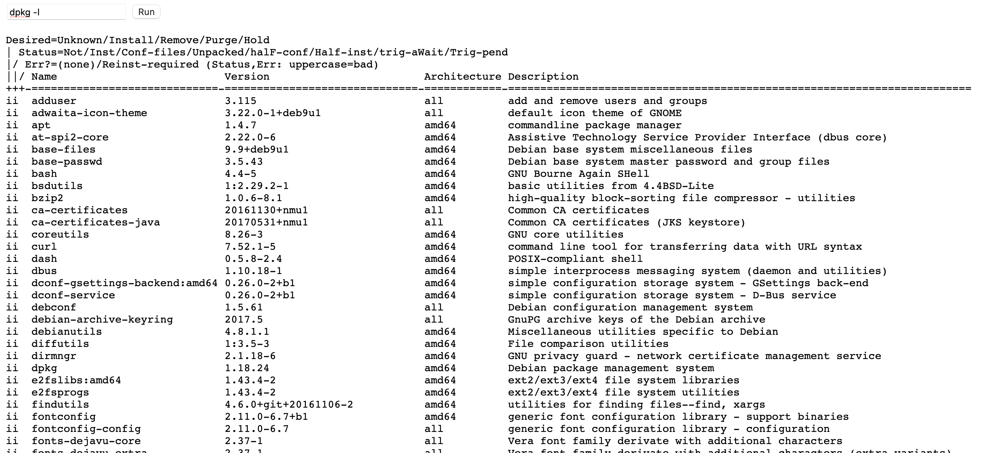

# Docker base image vulnerability exploit

## Prerequisites
* Docker Desktop (Mac / Windows) or Docker-CE (Linux) installed
* docker-compose installed  
* java-goof app running in container as per top level [README](/README.md) instructions

## Overview
The default base image `tomcat:8.5.21` is vulnerable to RCE [CVE-2017-12617](https://snyk.io/vuln/SNYK-JAVA-ORGAPACHETOMCAT-451514)
and an demonstration exploit, taken from [Exploit-DB](https://www.exploit-db.com/exploits/42966) is available in the exploits directory.

## Setting up the exploit
With the app running locally on `0.0.0.0:8080` set up as follows:

```bash
cd exploits
source tomcat-rce.sh   # Note: this will attempt to automatically grab your host IP and will echo it out, make sure it's correct for your OS
```

## Checking if app server is vulnerable
Now you can run the `check` alias to see if the tomcat server is vulnerable.
If it is you should see something similar to the following:

```ascii
$ check
   _______      ________    ___   ___  __ ______     __ ___   __ __ ______ 
  / ____\ \    / /  ____|  |__ \ / _ \/_ |____  |   /_ |__ \ / //_ |____  |
 | |     \ \  / /| |__ ______ ) | | | || |   / /_____| |  ) / /_ | |   / / 
 | |      \ \/ / |  __|______/ /| | | || |  / /______| | / / '_ \| |  / /  
 | |____   \  /  | |____    / /_| |_| || | / /       | |/ /| (_) | | / /   
  \_____|   \/   |______|  |____|\___/ |_|/_/        |_|____\___/|_|/_/    

[@intx0x80]

Poc Filename  Poc.jsp
File Created ..
http://192.168.1.2:8080 it's Vulnerable to CVE-2017-12617
http://192.168.1.2:8080/Poc.jsp
```

If you point a browser at http://localhost:8080/Poc.jsp you should get a test page with a bunch of "A" char's - that shows the exploit worked.

## Inject the exploit and run commands in the container from browser 
Next, run the `pwn` alias and just hit `ENTER` at the shell prompt that comes up. (Ignore the error afterward)

```ascii
$ pwn
   _______      ________    ___   ___  __ ______     __ ___   __ __ ______ 
  / ____\ \    / /  ____|  |__ \ / _ \/_ |____  |   /_ |__ \ / //_ |____  |
 | |     \ \  / /| |__ ______ ) | | | || |   / /_____| |  ) / /_ | |   / / 
 | |      \ \/ / |  __|______/ /| | | || |  / /______| | / / '_ \| |  / /  
 | |____   \  /  | |____    / /_| |_| || | / /       | |/ /| (_) | | / /   
  \_____|   \/   |______|  |____|\___/ |_|/_/        |_|____\___/|_|/_/    

[@intx0x80]

Uploading Webshell .....
$ 
Traceback (most recent call last):
  File "/exploit.py", line 188, in <module>
    shell(str(url),pwn)
  File "/exploit.py", line 98, in shell
    cmd=input("$ ")
  File "<string>", line 0
    
    ^
SyntaxError: unexpected EOF while parsing
```

Now open a browser to http://localhost:8080/pwn.jsp

You should see a blank page with a form containing single field and a `Run` button.  Type any Linux command you want and submit the form.
The results will populate the page.

Example 1: `whoami`


Example 2: `dpkg -l`


## Running a container scan
From the repo top-level directory, find the image tag for the goof app.  If you built using `docker-compose up --build` then the image tag should be `java-goof_javagoof:latest`
Run a scan with `--app-vulns` and dump the output to a file because it's going to be huge!

```bash
$ snyk container test java-goof_javagoof:latest --file=Dockerfile --app-vulns > snyk.out
\ Analyzing container dependencies for java-goof_javagoof:latest/Dockerfile
...
```

When complete, open the snyk.out file and search for `SNYK-JAVA-ORGAPACHETOMCAT-451514`
```ascii
  Upgrade org.apache.tomcat:tomcat-util@8.5.21 to org.apache.tomcat:tomcat-util@8.5.51 to fix
  ✗ Arbitrary File Upload [High Severity][https://snyk.io/vuln/SNYK-JAVA-ORGAPACHETOMCAT-551994] in org.apache.tomcat:tomcat-util@8.5.21
    introduced by org.apache.tomcat:tomcat-util@8.5.21
  ✗ Denial of Service (DoS) [High Severity][https://snyk.io/vuln/SNYK-JAVA-ORGAPACHETOMCAT-451507] in org.apache.tomcat:tomcat-util@8.5.21
    introduced by org.apache.tomcat:tomcat-util@8.5.21
  ✗ Arbitrary Code Execution [High Severity][https://snyk.io/vuln/SNYK-JAVA-ORGAPACHETOMCAT-451514] in org.apache.tomcat:tomcat-util@8.5.21
    introduced by org.apache.tomcat:tomcat-util@8.5.21
```

Next, search the file for `Recommendations`

```ascii
Tested 289 dependencies for known issues, found 594 issues.

Base Image     Vulnerabilities  Severity
tomcat:8.5.21  594              234 high, 173 medium, 187 low

Recommendations for base image upgrade:

Minor upgrades
Base Image     Vulnerabilities  Severity
tomcat:8.5.64  111              22 high, 12 medium, 77 low

Major upgrades
Base Image     Vulnerabilities  Severity
tomcat:10.0.0  130              36 high, 17 medium, 77 low

Alternative image types
Base Image                             Vulnerabilities  Severity
tomcat:8.5-jdk15-openjdk-oraclelinux7  0                0 high, 0 medium, 0 low
tomcat:10.0-jdk16-corretto             0                0 high, 0 medium, 0 low
tomcat:8.5-jdk8-corretto               0                0 high, 0 medium, 0 low
tomcat:10-jdk15-corretto               0                0 high, 0 medium, 0 low
```

Kill the running docker-comose process to shut down the app.

Edit the Dockerfile to use the "Major upgrade" recommendation, `FROM tomcat:8.5.64` at the top of the final stage.
```dockerfile
#FROM tomcat:8.5.21
FROM tomcat:8.5.64
RUN mkdir /tmp/extracted_files
COPY --chown=tomcat:tomcat web.xml /usr/local/tomcat/conf/web.xml
COPY --from=build /usr/src/goof/todolist-web-struts/target/todolist.war /usr/local/tomcat/webapps/todolist.war
```

Re-run `docker-compose up --build`

Re-run `check` alias and you should see that the app server is no longer vulnerable.
```ascii
$ check
   _______      ________    ___   ___  __ ______     __ ___   __ __ ______ 
  / ____\ \    / /  ____|  |__ \ / _ \/_ |____  |   /_ |__ \ / //_ |____  |
 | |     \ \  / /| |__ ______ ) | | | || |   / /_____| |  ) / /_ | |   / / 
 | |      \ \/ / |  __|______/ /| | | || |  / /______| | / / '_ \| |  / /  
 | |____   \  /  | |____    / /_| |_| || | / /       | |/ /| (_) | | / /   
  \_____|   \/   |______|  |____|\___/ |_|/_/        |_|____\___/|_|/_/    

[@intx0x80]

Poc Filename  Poc.jsp
Not Vulnerable to CVE-2017-12617 
```

You can alos show that http://localhost:8080/Poc.jsp did not inject the "AAAA" page